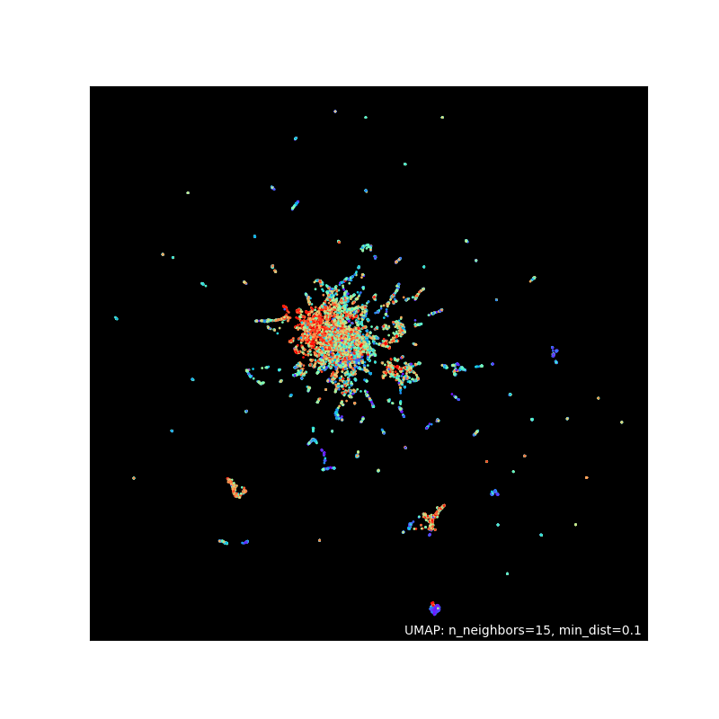
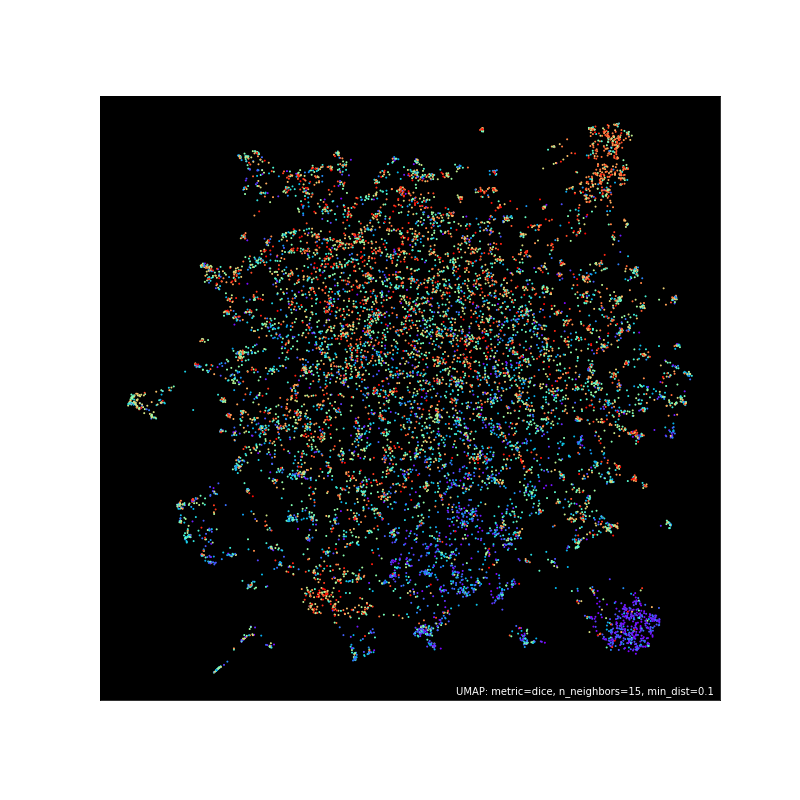

## Bioengineering project/thesis

### **Gene expression**
Data containing gene expression for breast cancer patients is called **brca_counts.rds** and it needs to be converted to *.csv* as python cannot use *.rds* files.
```R
brca <- readRDS('brca_counts.rds')
write.csv(brca, 'brca.csv')
```

### **Node2Vec**
The functional network used is from
> Wu, G., Feng, X. & Stein, L. A human functional protein interaction network and its application to cancer data analysis. Genome Biol 11, R53 (2010). https://doi.org/10.1186/gb-2010-11-5-r53

Node2Vec only allows integers as nodes and the nodes of the network file above are UniProt accession numbers so it has to be converted:
```R
library(tidygraph)
library(dplyr)

network_table <- read.table('FIs_043009.txt', header = FALSE)
networkasgraph <- as_tbl_graph(network_table)

networkasgraph %>%
  activate(edges) %>%
  write.table('n2v-in.edgelist', row.names = FALSE, col.names = FALSE)
```
Then, Node2Vec is run with the default parameters:
```
./node2vec -i:n2v-in.edgelist -o:n2v-out.emb -v
```
And the Node2Vec output is visualized using UMAP:
```py
import numpy as np
import pandas as pd
import matplotlib.pyplot as plt
import umap
import umap.plot

emb = pd.read_csv('n2v-out.emb', skiprows = 1, sep = ' ', header = None, index_col=0)
emb_data = emb.to_numpy()
emb_labels = emb.index.to_numpy()

embmapper = umap.UMAP(n_epochs= 400).fit(emb_data)

p = umap.plot.points(embmapper, labels = emb_labels, show_legend= False, theme = 'fire')

umap.plot.show(p)
```


After investigating to see which metrics are better, we came to the conclusion that a metric of 'dice' and an output metric of 'mahalanobis' would yield an viable and interesting result which looks like this:
```py
umap_emb = umap.UMAP(
    n_epochs = 400,
    random_state = 42,
    metric = 'dice',
    output_metric = 'mahalanobis'
).fit_transform(emb_data)

np.save('umap_emb', umap_emb)
```


Now that we have the coordinates for the genes, we can create a template dataframe containing the node id, coordinates, ENSEMBL id and UniProt accession number and normalize this dataframe to fit a 300 by 300 image.

```py
biomart = pd.read_csv('mart_export.tsv', sep='\t') # File downloaded from Biomart that matches ENSEMBL genes with UniProt accession numbers
network = pd.read_csv('FIs_043009.txt', header=None, sep = ' ').rename(columns = {0: 'from', 1: 'to'}) # Network file including only edges as UniProt accession numbers
used_uprots = pd.read_csv('node_id_name.tsv', sep='\t').rename(columns = {'name': 'UniProtKB Gene Name ID'}) # All nodes in the network with node ids

umap_emb_x, umap_emb_y = zip(*umap_emb)
umap_coord = pd.DataFrame([emb_labels, umap_emb_x, umap_emb_y]).transpose().rename(columns = {0: 'node_id', 1: 'x', 2: 'y'})

normal_umap_coord_x = umap_coord['x'].apply(lambda v: (v - umap_coord['x'].min()) / (umap_coord['x'].max() - umap_coord['x'].min()) * 300).round()
normal_umap_coord_y = umap_coord['y'].apply(lambda v: (v - umap_coord['y'].min()) / (umap_coord['y'].max() - umap_coord['y'].min()) * 300).round()
normal_umap_coord = pd.DataFrame([umap_coord['node_id'], normal_umap_coord_x, normal_umap_coord_y]).transpose().round(3).astype(int)

human_genes = biomart.drop_duplicates(subset = 'Gene stable ID', keep = 'first', ignore_index = True).sort_values(by = 'Gene stable ID', ignore_index = True).dropna(subset = ['UniProtKB Gene Name ID', 'UniProtKB/Swiss-Prot ID', 'UniProtKB/TrEMBL ID'], how = 'all').fillna(axis = 1, method = 'bfill').drop(columns = ['UniProtKB/Swiss-Prot ID', 'UniProtKB/TrEMBL ID'])

firsttemplate = pd.merge(human_genes, used_uprots, how = 'inner', on = 'UniProtKB Gene Name ID')
# template is saved to a file called 'template-data.csv'
template = pd.merge(normal_umap_coord, firsttemplate, on = 'node_id') 
```

Now, we must extract the gene expression data of all the patient and store it in a huge (1222, 300, 300, 3) array. This array is explained as 1222 images with a width x height of 300 x 300 and 3 color layers (RGB). To achieve this, we must first extract one of (300, 300, 3) and loop it over 1222 values.

```py
brcaex = pd.read_csv('brca.csv').rename(columns = {'Unnamed: 0': 'Gene stable ID'}) # Gene expression table for all patients with ENSEMBL genes 
patientex = brcaex.iloc[:, :2] # Gene expression values for the first patient
nimg = np.zeros((300, 300, 3)).astype('uint8') # Creates an empty (300, 300, 3) array to be filled later

# Template data merged with patient expression data
coorex = pd.merge(template, patientex).sort_values(by = 'Gene stable ID', ignore_index = True).drop(columns = ['node_id']).groupby(['x', 'y']).mean().round().astype(int)

((k, l), m) = zip(*coorex.index), coorex.iloc[:, -1].values

for i in range(len(k)):
    b = m[i] & 255
    g = (m[i] >> 8) & 255
    r = (m[i] >> 16) & 255
    
    if k[i] == 300 or l[i] == 300:
        continue
        
    nimg[k[i]][l[i]] = [r, g, b]
```

When we check the shape of the ```nimg``` array, we'll see that it's a (300, 300, 3) shaped array that is filled with values between 0-255. This is only one of 1222.
Next task on the list is to run the code above for 1222 patients and store it in a big array.

```py
groundt = pd.read_csv('samples_fileid_tumor.tsv', sep = '\t', index_col = 0) # Ground truth provided to us (Labels for training)
genes = brcaex.iloc[:, 0] # ENSEMBL genes available in our patient gene expression data

allimg = np.zeros((brcaex.shape[1] - 1, 300, 300, 3)).astype('uint8') # Creates the huge array to be filled

# The loop for building the (1222, 300, 300, 3) array with small (300, 300, 3) ones
for a in range(brcaex.shape[1]):
    if a == brcaex.shape[1] - 1:
        continue

    patientex = pd.concat([genes, brcaex.iloc[:, a + 1]], axis = 1)
    coorex = pd.merge(template, patientex).sort_values(by = 'Gene stable ID', ignore_index = True).drop(columns = ['node_id']).groupby(['x', 'y']).mean().round().astype(int)
    ((k, l), m) = zip(*coorex.index), coorex.iloc[:, -1].values
    
    nimg = np.zeros((300, 300, 3)).astype('uint8')
    
    for i in range(len(k)):
        b = m[i] & 255
        g = (m[i] >> 8) & 255
        r = (m[i] >> 16) & 255
    
        if k[i] == 300 or l[i] == 300:
            continue
        
        nimg[k[i]][l[i]] = [r, g, b]
    
    allimg[a] = nimg

# Tidying and saving the file
intermediatedf = pd.merge(brcaex.iloc[0:1,:], groundt.transpose(), how = 'outer').dropna(axis = 1)
labelarray = intermediatedf.loc[1].to_numpy().astype('uint8')

np.savez_compressed('train-data', data = allimg, labels = labelarray)
```

Now that we've obtained our training data, we can start training our CNN (Convolutional Neural Network) model.

```py
import numpy as np
from sklearn.model_selection import train_test_split
import tensorflow as tf
from tensorflow.keras import datasets, layers, models
import matplotlib.pyplot as plt

arrays = np.load('train-data.npz')
train_images, test_images, train_labels, test_labels = train_test_split(arrays['data'], arrays['labels'], test_size = 0.2)

train_images, test_images = train_images / 255.0, test_images / 255.0

model = models.Sequential()
model.add(layers.Conv2D(128, (3, 3), activation='relu', input_shape=(300, 300, 3)))
model.add(layers.MaxPooling2D((2, 2)))
model.add(layers.Conv2D(64, (3, 3), activation='relu'))
model.add(layers.MaxPooling2D((2, 2)))
model.add(layers.Conv2D(64, (3, 3), activation='relu'))
model.add(layers.MaxPooling2D((2, 2)))
model.add(layers.Flatten())
model.add(layers.Dense(64, activation='relu'))
model.add(layers.Dense(1, activation='sigmoid'))

model.compile(optimizer='adam',
              loss='binary_crossentropy',
              metrics=['accuracy'])

history = model.fit(train_images, train_labels, epochs=25, validation_data=(test_images, test_labels))

plt.plot(history.history['accuracy'], label='accuracy')
plt.plot(history.history['val_accuracy'], label = 'val_accuracy')
plt.xlabel('Epoch')
plt.ylabel('Accuracy')
plt.ylim([0.5, 1])
plt.legend(loc='lower right')

test_loss, test_acc = model.evaluate(test_images,  test_labels, verbose=2)

print(test_acc)

model.save("brca/2/")
```